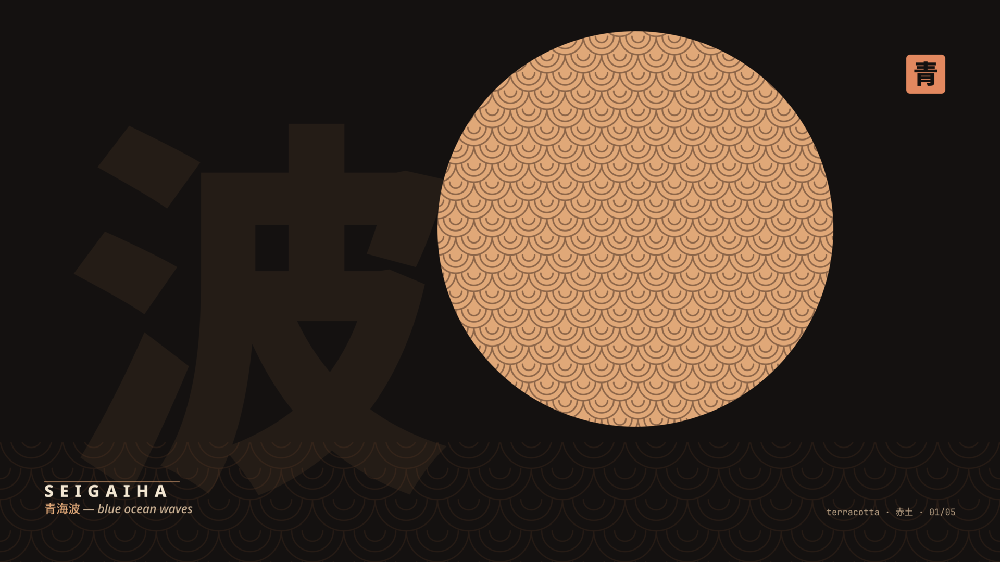

# Terracotta · 赤土

A dark [Omarchy](https://omarchy.org) theme — terracotta clay over a charcoal *raku* (炭) base, textured with traditional Japanese patterns (*wagara*, 和柄) and composed in a Japanese-constructivist key.



## Install

```bash
omarchy-theme-install https://github.com/skvggor/omarchy-terracotta-theme
```

Then pick **Terracotta** from `omarchy theme` (or the theme menu).

## Palette

Charcoal raku base, terracotta accents. Greens borrow from *matcha* (抹茶), blues from *ai* (藍) and magentas from *sakura* (桜) — every hue stays inside the same wagara universe.

Every foreground and ANSI color meets **WCAG AAA** (≥7:1) against the background. `color0` is the structural ANSI black (never body text), so it stays dark by convention.

| Role        | Hex       | Role        | Hex       |
| ----------- | --------- | ----------- | --------- |
| background  | `#141110` | foreground  | `#f2e6d2` |
| accent      | `#e0a878` | cursor      | `#e0a878` |
| selection   | `#6a3f24` | black/8     | `#1f1b18` / `#b29c7e` |
| red/9       | `#e08a60` / `#e89066` | green/10 | `#9bb081` / `#b3c595` |
| yellow/11   | `#e6b07e` / `#f0c8a0` | blue/12  | `#84aabc` / `#9cbfd0` |
| magenta/13  | `#d89595` / `#e0a8a8` | cyan/14  | `#85b1a5` / `#a3c9be` |
| white/15    | `#cbb295` / `#f2e6d2` |          |           |

Everything except the wallpapers is generated by Omarchy from [`colors.toml`](colors.toml).

## Backgrounds

Five 4K wallpapers, each a constructivist poster built from one *wagara* pattern, in the *omakase* (お任せ) spirit — chef's selection:

1. **seigaiha** 青海波 — waves
2. **asanoha** 麻の葉 — hemp leaf
3. **shippo** 七宝 — seven treasures
4. **kikko** 亀甲 — tortoiseshell
5. **yabane** 矢絣 — arrow feathers

Regenerate them with [`tools/generate-backgrounds.py`](tools/generate-backgrounds.py).

## Companion themes

The same palette, ported to the editors Omarchy wires up automatically:

- **Neovim** — [`skvggor/terracotta.nvim`](https://github.com/skvggor/terracotta.nvim) (referenced by [`neovim.lua`](neovim.lua))
- **VS Code** — [`skvggor/terracotta.vscode`](https://github.com/skvggor/terracotta.vscode) (referenced by [`vscode.json`](vscode.json))

## License

[MIT](LICENSE) © Marcos Garcia de Lima. Patterns mirror the wagara work across [skvggor.dev](https://skvggor.dev).
